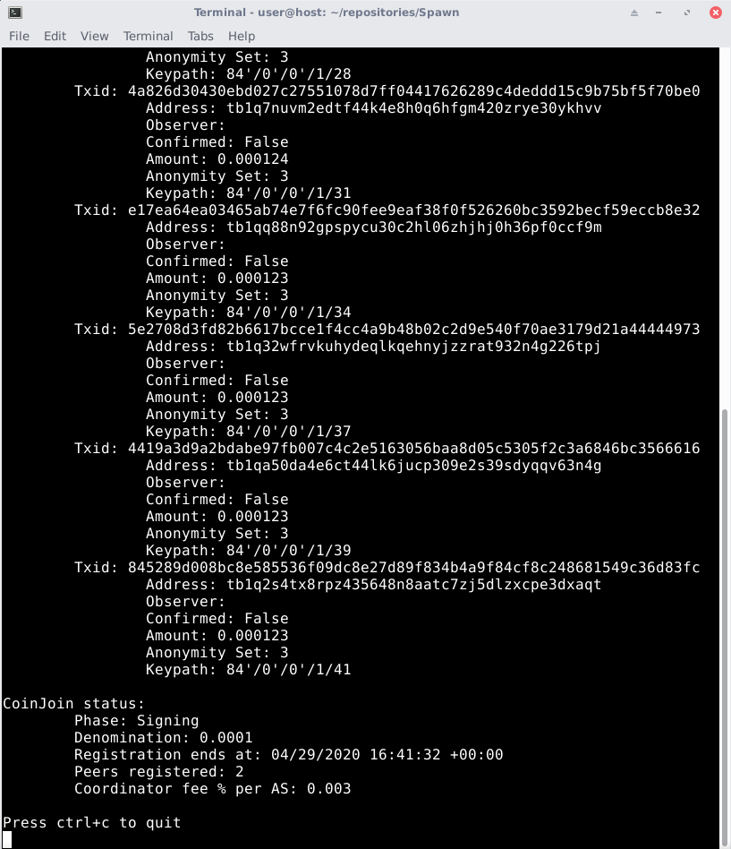

# Spawn

Spawn is a small Python script to automatize the Wasabi mixing process.
It leverages the Wasabi's [RPC interface](https://docs.wasabiwallet.io/using-wasabi/RPC.html#wasabi-remote-procedure-call-interface) and [daemon](https://docs.wasabiwallet.io/using-wasabi/Daemon.html#headless-wasabi-daemon).

The **core** of Spawn is the automatic creation of a new wallet, called `spawned`, which goal
is to keep the mixing history totally segregated from the user wallets.
Spawned wallets are conceived to be short lived and to be renewed often.

Spawn allows to mix with Wasabi barely touching the GUI (potentially never),
offers a simple command line interface to follow the daemon mixing and
uses the daemon's only feature of directly mixing into destination.

Spawn should work without any difference on both Testnet and Mainnet (change it
either in the Wasabi's `config.json` file or through the GUI)
and should work with either deb package, tar.gz. or source code.

If you backup your funds (**always do backup!**), losing funds should be virtually impossible,
all the mixing process and Bitcoin operations are handled by Wasabi as usual.

Spawn is ready for testing, at the current stage it has been tested quite
extensively on Testnet.
Always try it out on Testnet first and, if you cannot read the code yourself,
ask someone you trust to verify it before using it with real funds!

Use at your own risk!

Feedbacks and PRs are welcome.

## Requirements

* Linux only, tested on Ubuntu and Debian.
Should be possibile to make it work on Windows or Mac but I have no
experience with neither of them.

* [Wasabi](https://wasabiwallet.io/) 1.1.11+

* Python 3.7+ (should be already installed with Linux)

* [Requests](https://requests.readthedocs.io/en/master/) and [Pexpect](https://pexpect.readthedocs.io/en/stable/) modules. (If you are using Tails, both packages
are already installed)

* (Optional) If you want to see the CoinJoin info, such as number of peers registered,
denomination, timeout, exc... you need Tor installed. This is because the
request to the backend API is done through Tor to the Onion Service.

## Setup

If you have never launched Wasabi before, you'll need to launch it manually (this has to be done just once),
this is because we need Wasabi to create the config.json file and you need to
enable the RPC server. This is easily done by setting `JsonRpcServerEnabled` to `true`
in the `config.json` file, you can find it in the [Wasabi data folder](https://docs.wasabiwallet.io/FAQ/FAQ-UseWasabi.html#where-can-i-find-the-wasabi-data-folder).

The script is ready to use, you only need to configure the settings in
the `settings.py` file and provide a destination wallet.

* `launch_path` (Mandatory): Leaving it to empty will launch Wasabi through `wassabee` command,
this works with deb package installed. If you are running source code or a
tar.gz. extracted somewhere, specify here the path where you would launch Wasabi.
* `auto_generate` (Mandatory): If `False`, the default, you'll have to provide your own
password at wallet creation. If `True`, Spawn will randomly generate for you a
25 character alphanumeric password using the [secrets](https://docs.python.org/3/library/secrets.html) module from the Python standard library.
* `auto_backup` (Mandatory): If `False`, the default, it does nothing. If `True`, Spawn
will automatically backup the `spawned.json` generated wallet file into the
Spawn repository folder.
* `JsonRpcUser` and `JsonRpcPassword` (Optional): If you set these two in your `config.json`
file in the Wasabi data folder, you have to set them here too, otherwise you'll
receive a `WrongCredentials` error.
* `observer` (Mandatory): This set the [observer](https://docs.wasabiwallet.io/using-wasabi/Receive.html#observers) name of the generated addresses.
Each spawned wallet should have a unique observer, use different spawned wallets
for different observers.
* `num_addresses` (Mandatory): This sets the number of addresses generated by Spawn.
Max is 20 and default is 10. If you need more addresses you should try to use another spawned wallet.
Note that you can deposit to any address of the spawned wallet, but they won't be tracked in the `receiving_addresses.txt` file.
So, if you don't use the automatically generated addresses, you'll have to keep track of them (to avoid address reuse) by yourself.
* `destination` (Mandatory): This sets the destination wallet for the Wasabi mixing.
The funds will be send to this destination wallet during the CoinJoin, without need
to manually send them. The destination wallet has to be in the `Wallets` folder in the
Wasabi data folder. The destination has to be provided without the `.json` extension.

## Usage

* Clone or download the repository
* Open the Spawn repository
* Open a terminal and type `python3 spawn.py`
* Follow the instruction

The first time you launch Spawn it will copy a `placeholder.json` wallet file
in your wallet folder. That's it, a placeholder, its only goal is to allow
Spawn to launch the daemon the first time. It should **never** holds any funds(!) and
can be safely removed.

To generate a new spawned wallet, remove the current `spawned.json` file
from the `Wallets` folder or rename it. **Keep in mind** that Spawn will overwrite
the `receiving_addresses.txt` file, so you may want to save it somewhere or
keep multiple copies of the repository.

At any time you can stop using Spawn and manually use the spawned.json wallet
through the Wasabi's GUI or daemon.
Sometimes you'll have to do this to manage the [change](https://docs.wasabiwallet.io/using-wasabi/ChangeCoins.html#change-coins).
Please read **carefully** the documentation about change!

If you need to [recover](https://docs.wasabiwallet.io/using-wasabi/WalletRecovery.html#recover-a-wallet)
your spawned wallet from recovery words + password,
you'll likely need to **increase** the `Minimum Gap Limit`.
A value of 40 should be enough to cover all the Spawn generated addresses,
but you can set it to something like 50 or 100, just to be sure that all your funds show up.

Enjoy!
